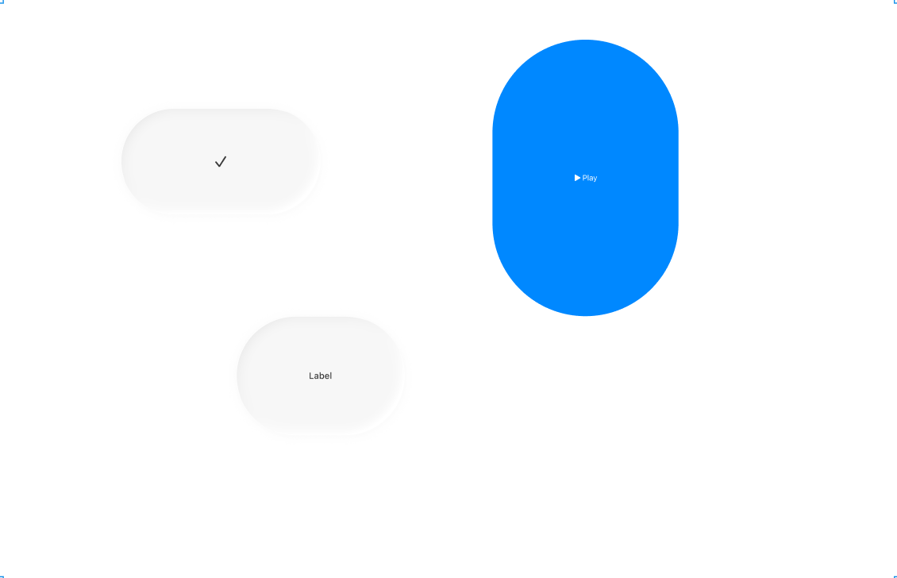
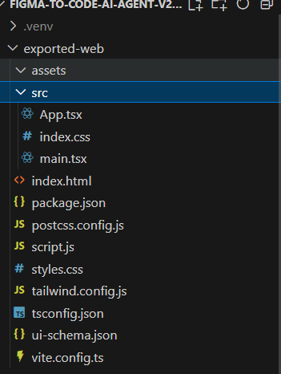
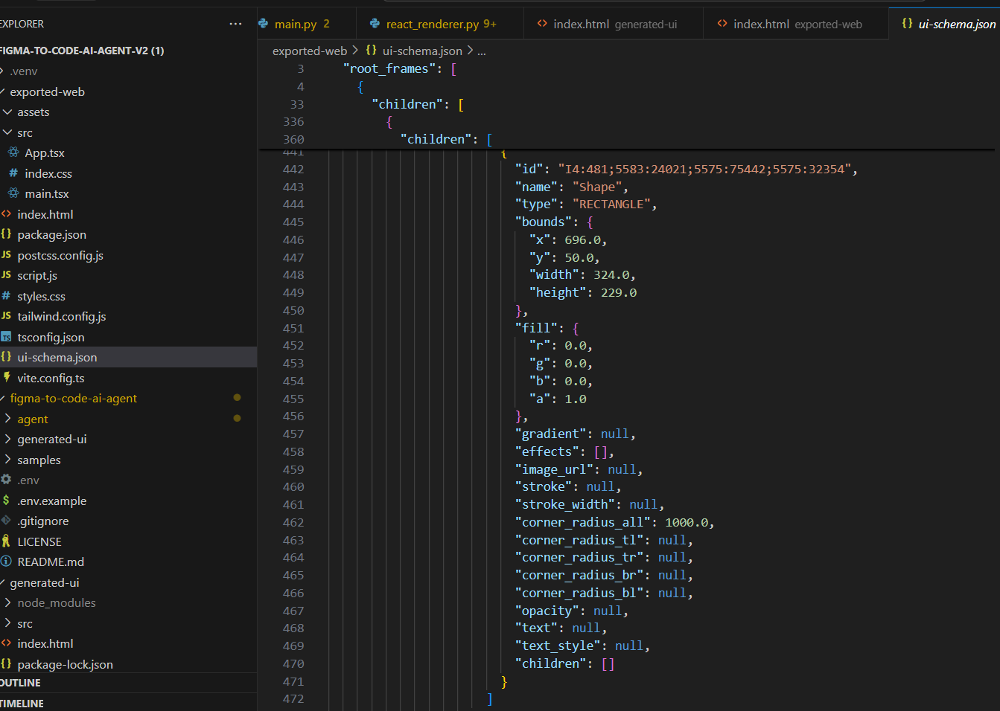
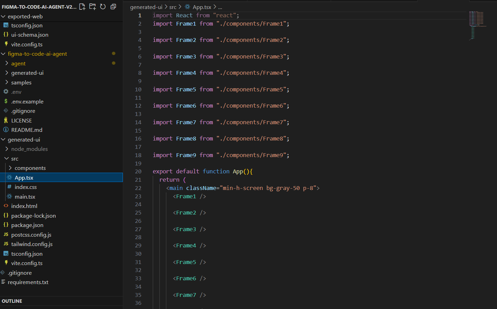

# Figma-to-Code AI Agent

## Demo (Selected Screenshots)

### 1) Input: Figma Frame
Shows the source design with the frame and layers selected (ground truth for the export).
  


### 2) Output: Folder Tree
Static export / generated code artifacts (e.g., `exported-web/` or `generated-ui/`) and key files.
  


### 3) UI Schema (Excerpt)
Normalized JSON the tool builds from Figma (positions, fills/gradients/images, strokes, radii, text styles, effects).
  


### 4) React Code Components (AI Path)
Generated React + TSX components (LLM path) that compose the page, ready to run with Vite dev server.
  


Convert Figma designs into **real code** in two ways:

1. **Deterministic Web Export** → pixel-faithful **HTML/CSS/JS** (no frameworks, no AI).
2. **AI React Export (Gemini + LangChain)** → reusable **React + TSX** components scaffolded in a **Vite** app.

This repo is designed for hands-off demos, portfolio artifacts, and fast design→code iteration.

---

## Table of Contents
- [Why](#why)
- [What You Get](#what-you-get)
- [Prerequisites](#prerequisites)
- [Setup](#setup)
- [Environment Variables](#environment-variables)
- [Usage](#usage)
  - [A) Deterministic Web Export (HTML/CSS/JS)](#a-deterministic-web-export-htmlcssjs)
  - [B) AI React Export (Gemini + Vite)](#b-ai-react-export-gemini--vite)
- [Screenshots](#screenshots)
- [Project Structure](#project-structure)
- [How It Works (High Level)](#how-it-works-high-level)
- [Troubleshooting](#troubleshooting)
- [Security](#security)
- [License](#license)

---

## Why
- **Kill designer→dev handoff pain**: automate the boring re-implementation of layouts.
- **Move fast**: tweak in Figma → regenerate code in seconds.
- **Choose fidelity vs. abstraction**: pixel-faithful static export or componentized React output.
- **Traceability**: exports are backed by a normalized `ui-schema.json`.

---

## What You Get
- **Static bundle** (deterministic): `index.html`, `styles.css`, `script.js`, `ui-schema.json`, and `assets/` (images).
- **React bundle** (AI path): Vite app with `src/App.tsx` and `src/components/*` (TSX), hot-reload dev server.

---

## Prerequisites
- **Python** 3.10+ (3.12 recommended)
- **Node.js** 18+ and **npm** (only required for the React/Vite path)
- A **Figma account** and a **Personal Access Token (PAT)** with these scopes:
  - Files → **Read metadata of files**
  - Files → **Read the contents of and render images from files**
- A **Figma Design file key** (URLs starting with `/file/` or `/design/`, *not* `/make/`)
- (For AI path) **Google Gemini API key** (e.g., `gemini-1.5-pro` or `gemini-2.0-flash`)

---

## Setup

```powershell
# 1) Clone/open the project root in VS Code
cd "C:\Anirudh Projects\figma-to-code-ai-agent-v2 (1)"

# 2) (Recommended) Create & activate a virtual env
python -m venv .venv
.\.venv\Scripts\Activate.ps1

# 3) Install Python deps
pip install -r requirements.txt


Environment Variables
Create a .env inside figma-to-code-ai-agent/:
```
ini
Copy code
GEMINI_API_KEY=YOUR_GEMINI_KEY           # required for AI React path
FIGMA_TOKEN=figd_XXXXXXXXXXXXXXXXXXXXX   # Figma PAT (use X-Figma-Token header)
FIGMA_FILE_ID=QbazU5XqmK1hTsJIYhoVwt     # your /file/ or /design/ key (not /make/)
MODEL_NAME=gemini-2.0-flash              # or gemini-1.5-pro if available
HTTP_TIMEOUT=30
```
Usage

All commands below are executed from:

C:\Anirudh Projects\figma-to-code-ai-agent-v2 (1)\figma-to-code-ai-agent

A) Deterministic Web Export (HTML/CSS/JS)
```
python -m agent.main --out ..\exported-web --format web --deterministic
# Open the result in your browser:
explorer "..\exported-web\index.html"
```
Output:
exported-web/

index.html – absolute-positioned DOM mirroring your Figma frame(s)

styles.css – base styles

script.js – empty starter for your logic

ui-schema.json – normalized schema we generated

assets/ – downloaded images used for image fills

B) AI React Export (Gemini + Vite)
```
# Generate React code (TSX) with Gemini
python -m agent.main --out ..\generated-ui --framework react

# Run Vite dev server
cd "..\generated-ui"
npm install
npm run dev
# visit http://localhost:5173


Project Structure

```
```

figma-to-code-ai-agent-v2 (1)/
├─ figma-to-code-ai-agent/
│  ├─ agent/
│  │  ├─ main.py                 # CLI entry: flags, flow control
│  │  ├─ config.py               # loads .env (tokens, model, file id)
│  │  ├─ figma_api.py            # Figma REST (uses X-Figma-Token)
│  │  ├─ schema.py               # UISchema models (bounds, fills, text, effects...)
│  │  ├─ codegen.py              # Gemini (LangChain) codegen/parsing (AI path)
│  │  └─ writers/
│  │     ├─ web_exporter.py      # writes index.html/styles.css/script.js/ui-schema.json (+assets)
│  │     ├─ react_writer.py      # writes TSX files from LLM output
│  │     └─ utils...
│  └─ .env                       # your secrets (NOT committed)
├─ exported-web/                 # output of deterministic web export
└─ generated-ui/                 # output of AI React export (Vite app)
```


Troubleshooting:

1. 403 Invalid token

- Regenerate your PAT with scopes:

 - - Files → Read metadata of files

 - - Files → Read the contents of and render images from files

- Ensure you’re using the same Figma account that owns/opens the file.

- We send the token via X-Figma-Token (works even if Bearer doesn’t).

2. 400 File type not supported by this endpoint

- Your link is likely a /make/ URL. Open in Figma → Duplicate to Drafts → use the new /file/ or /design/ key.

3. 403 on /files/<key> but /v1/me works

- You may not have API access to that file. Duplicate it to your Drafts and use that key.

- Vite error: missing plugin or node_modules

- Run npm install inside generated-ui/ before npm run dev.

